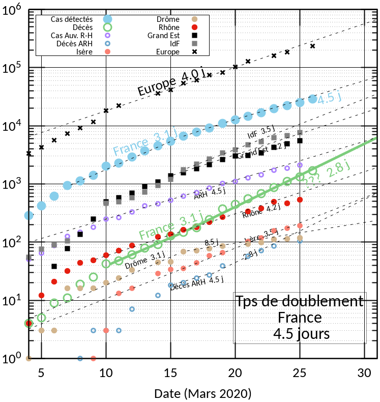

# COVID19 // Courbe quotidienne

## France : la courbe au 18 mars 2020

<!---

--->

## Liens utiles

* Données issues de Santé Publique France :
  * [chiffres-cles.json](https://github.com/opencovid19-fr/data/raw/master/dist/chiffres-cles.json)
  * [chiffres-cles.csv](https://github.com/opencovid19-fr/data/raw/master/dist/chiffres-cles.csv)
* Auvergne Rhône Alpes
  * [France3 Région](https://france3-regions.francetvinfo.fr/auvergne-rhone-alpes/carte-coronavirus-covid-19-se-trouvent-858-cas-confirmes-auvergne-rhone-alpes-1796941.html)
* [Espagne](https://covid19.isciii.es)
* [Italie](http://www.salute.gov.it/portale/news/p3_2_1_1_1.jsp?lingua=italiano&menu=notizie&p=dalministero&id=4255)

### IT, FR, ESP

## Commentaires & Comparaisons

### Régions françaises

* 18-mars: IdF emboîte le pas... Un début de tassement du nombre de cas en France ? Le nombre de décès suit sa courbe. Auvergne-Rhône-Alpes suit sa courbe. Grand-Est aussi. Bref, terrible à dire, mais on continue sur le même rythme. Restons à la maison...

* 17-mars: la courbe de l'*Ile-de-France* (pas montrée ici) suggère qu'elle
  entre dans la phase de propagation libre. Étant donné la population
  importante de l'IdF, on s'attend à ce que la progression Française
  soit malheureusement stable. _L'IdL compte depuis le 16 mars plus de
  cas que le Grand Est_.

### Mortalité

**Attention** ce que j'ai mis ici est simplement le rapport Décès/Cas. C'est donc une mortalité moyennée sur l'ensemble de la population. Et par ailleurs, c'est probablement une sur-estimation, car le nombre de cas est probablement plus grand que celui que l'on connaît.

* la mortalité en France est de 2%, en moyenne donc sur la pyramide des âges;

* la mortalité en Europe est de 4%, peut-être parce que dominée par
  l'Italie où la population est plus vieille. Regardez les pyramides des âges comparées ci-dessous.

### Comparaison des pyramides des âges
- Voici les pyramides des âges de la France, comparée à celles de l'Espagne et de l'Italie, en 2020. J'ai mis des catégories d'âges un peu guidées par covid19, à savoir <60 ans, 60-80 ans, et >80 ans.
- construites à partir de ce [site de l'INSEE (ultra bien fait)](https://www.insee.fr/fr/statistiques/2418102)

<!---[logo]: https://github.com/adam-p/markdown-here/raw/master/src/common/images/icon48.png "Logo Title Text 2"
[./covid19.png]--->
